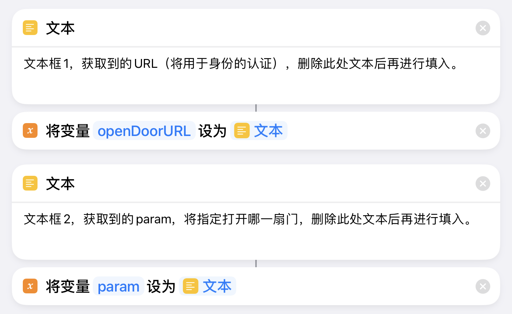
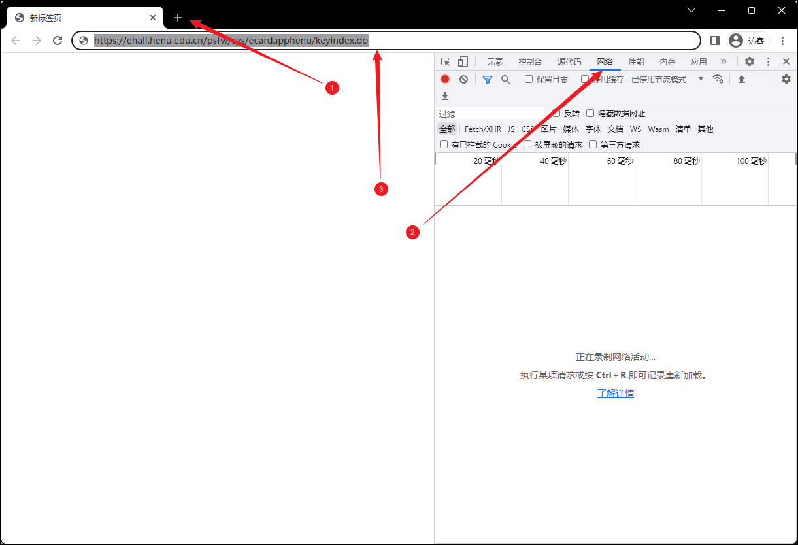
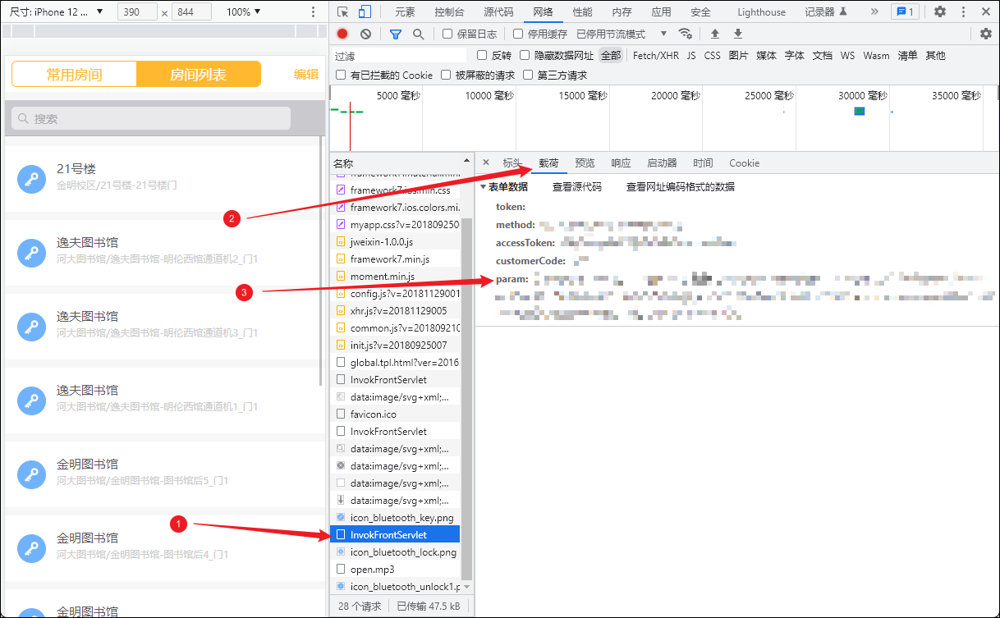
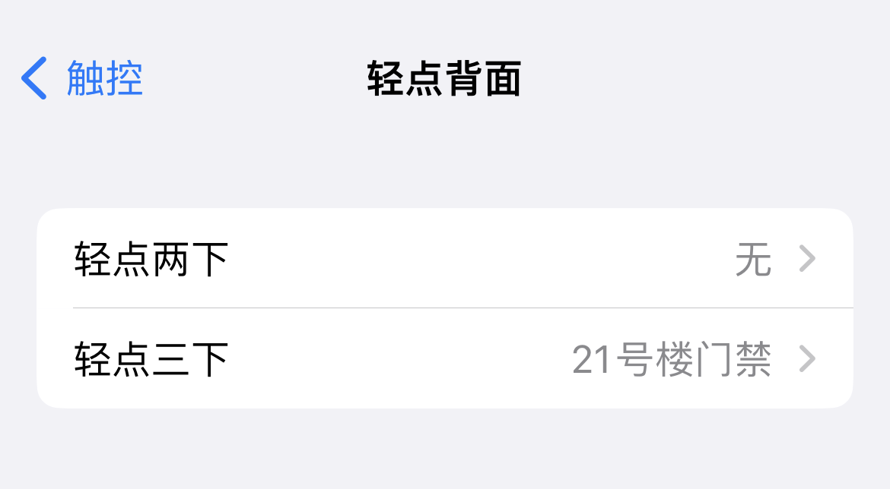

# IOS-Shortcut-AccessCard-for-Henu
通过快捷指令解决河南大学IOS门禁卡模拟问题

# 说明

万恶的苹果不给开放NFC权限，导致每次下楼都需要带门禁卡。

完美校园、今日校园的钥匙串又要开屏广告又要翻图标打开速度太慢。

不如来搞点事情，把钥匙串集成进快捷指令。

~~马上毕业，将丧失门禁权限，后续维护随缘~~

# 使用说明

1. 第一步：获取快捷指令。地址：https://www.icloud.com/shortcuts/9ad424cc9f82446daa56bc042cb65bd0

   编辑快捷令，请记好下图中的两个文本框：

   

2. 第二步：找到一台电脑，使用浏览器（以Chrome为例）登录河南大学统一身份认证平台登录：https://ids.henu.edu.cn/authserver/login

3. 第三步：按下图示按钮（序号1）打开一个空白的标签页；按F12，调出控制台，切换到“网络“（序号2）监控，然后在地址栏（序号3）粘贴学校的钥匙串服务链接：https://ehall.henu.edu.cn/psfw/sys/ecardapphenu/keyindex.do 并回车。

   

4. 第四步：可以看到，浏览器左侧已变成了钥匙串的界面，在左侧的门禁列表里找到想要打开的门，进行一次开门操作（一个快捷指令仅允许一扇门）。右侧的监控器为捕获的数据包。找到带有"authorize"字段的数据包（序号1），复制其右侧“标头-常规-请求网址“的全部内容（序号2，请求网址项的打码内容），粘贴进第一步中的**文本框1**。**注意不要向其他人泄露这些信息!!!**

   

5. 找到带有"InvokFrontServlet"字样的数据包（序号1），信息切换到载荷（序号2），复制"param"项的信息（序号3打码内容，此外如果这里的文本没有标识你开的那一扇们的具体名称，则说明错了，找找有没有其他的InvokFrontServlet），粘贴进第一步中的**文本框2**。**注意不要向其他人泄露这些信息!!!**

   

6. 保存并运行快捷指令，授予网络访问权限，如果没有“开门失败，请更新URL”的报错，则说明成功，此时可长按选择分享便可将快捷指令保存至桌面，点击桌面图标即可开门。或者在“设置—辅助功能—触控—轻点背面”设定轻点背面两下或三下运行，此时，锁屏状态下仅需手指敲击手机背面即可开门。

   

# 注意事项

1. 获取到URL后不要再打开今日校园和完美校园的钥匙串，不然认证Token会被刷新导致开门失败。
2. 如果遇到开门失败需则要重新获取文本框1的URL。
3. 运行快捷指令后听到门咔嚓一声响即开门成功。
4. **URL与你的个人信息绑定，不要泄露给他人，否则后果请自行承担。**
